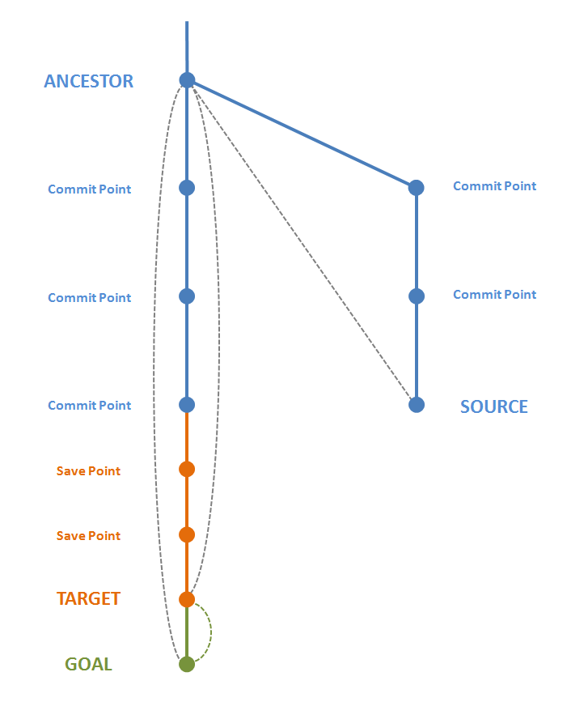
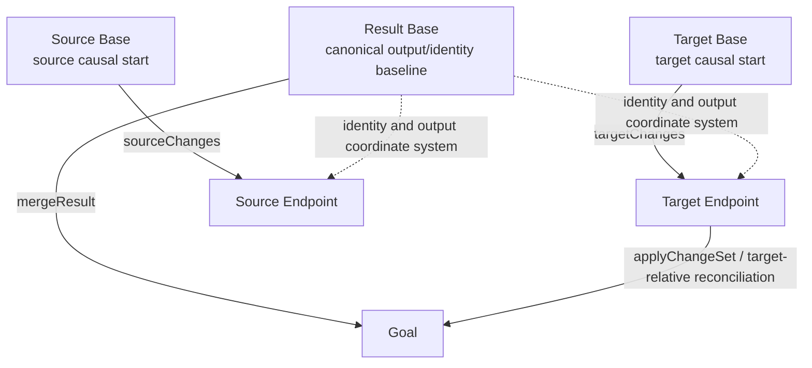
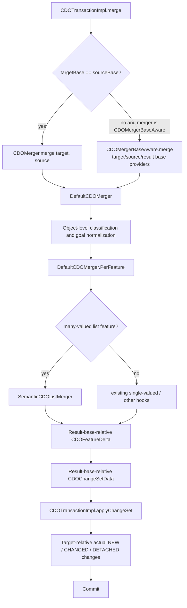
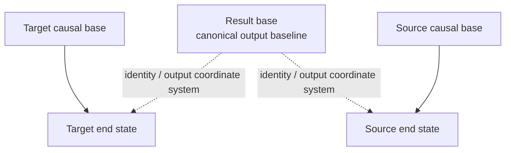
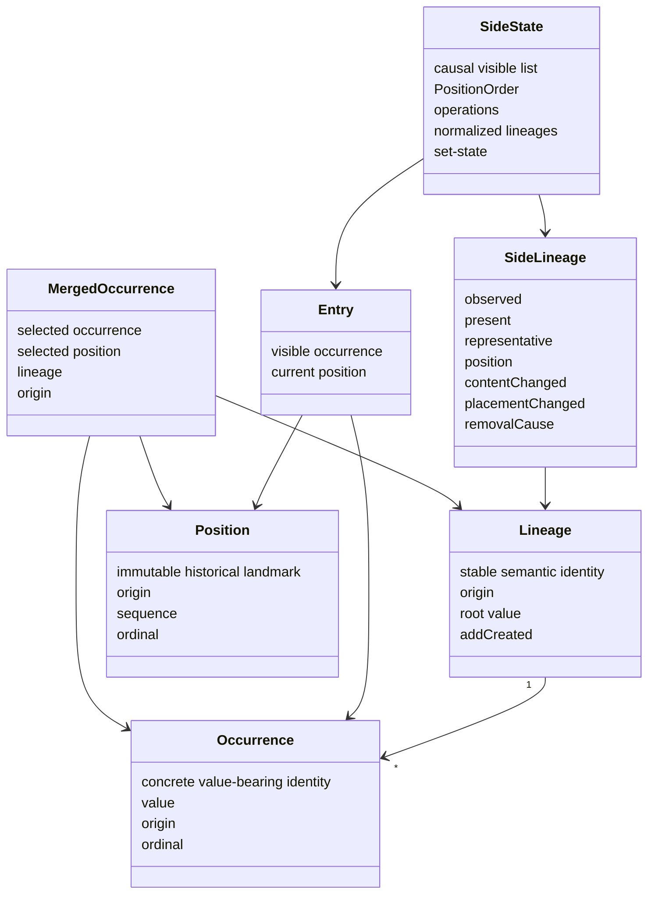
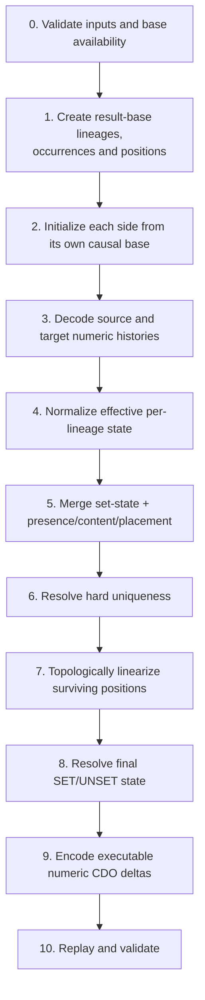
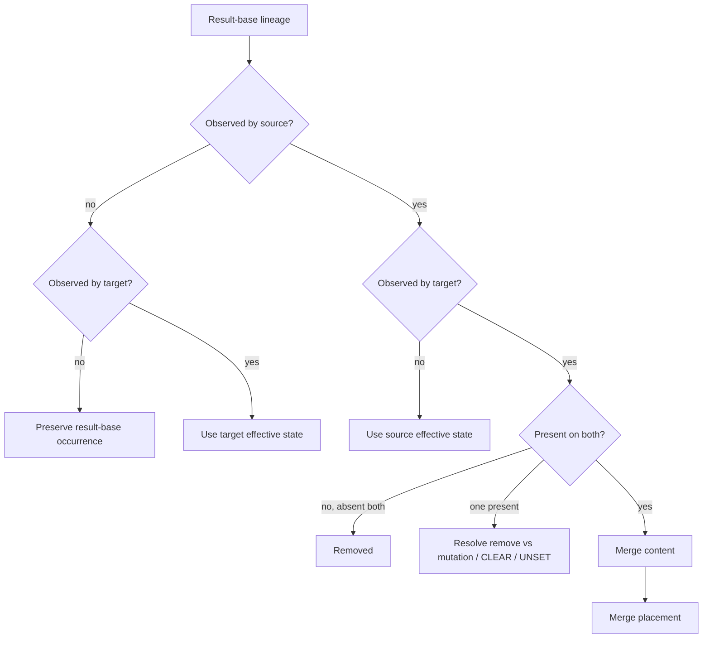
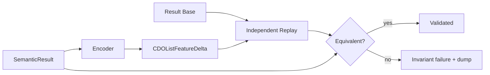
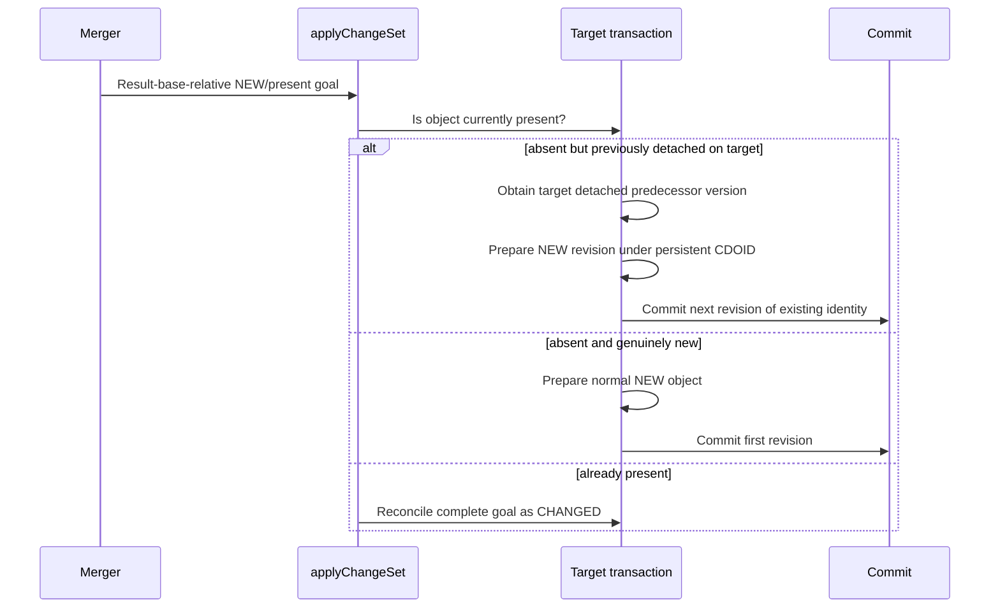

# CDO Semantic Merge Design

## A technical reference for `DefaultCDOMerger.PerFeature.ManyValued` and `SemanticCDOListMerger`

**Status:** Design reference for the semantic many-valued merge architecture  
**Semantic baseline:** Eclipse CDO commit `24fb108dc635bf0158c0ba48415110fb2dbe1ce6`  
**Additional basis:** the immediately following documentation/diagnostics hardening round, which did not change merge semantics  
**Primary package:** `org.eclipse.emf.spi.cdo`  
**Primary engine:** `SemanticCDOListMerger`

---

## Table of contents

0. [Terminology and conceptual merge picture](#0-terminology-and-conceptual-merge-picture)
1. [Purpose and scope](#1-purpose-and-scope)
2. [Why the merger needed a semantic model](#2-why-the-merger-needed-a-semantic-model)
3. [System-level architecture](#3-system-level-architecture)
4. [The three-base model](#4-the-three-base-model)
5. [Result-base-relative goals versus target-relative application](#5-result-base-relative-goals-versus-target-relative-application)
6. [Semantic domain model](#6-semantic-domain-model)
7. [Core invariants](#7-core-invariants)
8. [End-to-end merge pipeline](#8-end-to-end-merge-pipeline)
9. [Phase 0 — Preconditions and base validation](#9-phase-0--preconditions-and-base-validation)
10. [Phase 1 — Result-base identity initialization](#10-phase-1--result-base-identity-initialization)
11. [Phase 2 — Side-base correlation and observation](#11-phase-2--side-base-correlation-and-observation)
12. [Phase 3 — Decoding executable CDO list histories](#12-phase-3--decoding-executable-cdo-list-histories)
13. [Phase 4 — Normalization](#13-phase-4--normalization)
14. [Phase 5 — Merging presence, content, placement, and set-state](#14-phase-5--merging-presence-content-placement-and-set-state)
15. [CLEAR and UNSET semantics](#15-clear-and-unset-semantics)
16. [Phase 6 — Uniqueness resolution](#16-phase-6--uniqueness-resolution)
17. [Phase 7 — Partial-order linearization](#17-phase-7--partial-order-linearization)
18. [Ordering policy and stable ordering](#18-ordering-policy-and-stable-ordering)
19. [Phase 8 — Final set-state](#19-phase-8--final-set-state)
20. [Phase 9 — Identity-aware encoding](#20-phase-9--identity-aware-encoding)
21. [Phase 10 — Independent replay validation](#21-phase-10--independent-replay-validation)
22. [The five policy domains](#22-the-five-policy-domains)
23. [Object-level merge normalization in `DefaultCDOMerger`](#23-object-level-merge-normalization-in-defaultcdomerger)
24. [Base-aware merge dispatch](#24-base-aware-merge-dispatch)
25. [One-sided asymmetric histories](#25-one-sided-asymmetric-histories)
26. [Resurrection and persistent identities](#26-resurrection-and-persistent-identities)
27. [Determinism](#27-determinism)
28. [Diagnostics and failure classification](#28-diagnostics-and-failure-classification)
29. [Known information boundary: equal duplicate correlation](#29-known-information-boundary-equal-duplicate-correlation)
30. [Why the design is correctness-oriented](#30-why-the-design-is-correctness-oriented)
31. [Complexity and performance characteristics](#31-complexity-and-performance-characteristics)
32. [Executable validation and regression scenarios](#32-executable-validation-and-regression-scenarios)
33. [Debugging guide](#33-debugging-guide)
34. [Maintenance rules](#34-maintenance-rules)
35. [Glossary](#35-glossary)
36. [Source references](#36-source-references)

---

# 0. Terminology and conceptual merge picture

Before discussing the semantic list algorithm, it is useful to establish the vocabulary used throughout this document. Several terms — especially *base*, *result*, and *goal* — refer to different coordinate systems and must not be treated as synonyms.

## 0.1 A conceptual common-base merge

The following picture is a useful starting point for the ordinary three-way/common-base case.



**Figure 0.1 — Conceptual CDO merge.** The blue history represents committed history and the source side, orange represents the current target transaction including save points, and green represents the desired merged goal. The dashed spans should be read as conceptual change relations between a baseline and an endpoint, not as additional repository branch edges.

At the top, **ANCESTOR** is the revision state from which both participating histories are interpreted in the ordinary common-base case. The target has advanced from that state through committed revisions and then through transaction-local save points. The source has advanced independently on another branch. The merger combines the target and source changes and computes a **GOAL**: the desired semantic endpoint after the merge.

The picture deliberately distinguishes two different transformations:

```text
ANCESTOR  ----------------------------->  GOAL
             merged change-set goal

TARGET    ----------------------------->  GOAL
             target-relative application
```

The first arrow describes what the merger logically produces: a goal expressed relative to a selected result base. The second describes what the receiving transaction must actually do to reach that goal from its current target state.

Those transformations are often similar in a simple common-base merge, but they are not the same architectural operation.

### Common-base notation

For the simplest case:

```text
ancestor
   |
   +--------------------> target
   |
   +--------------------> source
   |
   +--------------------> goal
```

and:

```text
sourceBase = targetBase = resultBase = ancestor
```

The incoming histories can then be written as:

```text
targetChanges : ancestor -> target
sourceChanges : ancestor -> source
mergeResult   : ancestor -> goal
```

Afterwards `CDOTransactionImpl.applyChangeSet()` reconciles that result against the **actual current target**:

```text
application : target -> goal
```

This final application step is crucial because the classifications in the merge result (`NEW`, `CHANGED`, `DETACHED`) are defined relative to the **result base**, whereas the transaction must perform operations relative to its **current state**.

---

## 0.2 Core terminology

The following terms are used consistently throughout this document.

| Term | Precise meaning |
|---|---|
| **Side** | One participant in the merge: **source** or **target**. A side has a causal base, an executable history/change set, and an endpoint. |
| **Source** | The incoming/remote side whose changes are being merged into the target. `source` usually denotes the source endpoint or source change set depending on context; this document qualifies the term when ambiguity matters. |
| **Target** | The receiving/local side. At transaction level this is the state into which the merge is applied. It can include uncommitted save-point changes in addition to committed history. |
| **Endpoint** | The complete state reached after executing one side's change history from its causal base. `source endpoint` and `target endpoint` are useful terms when distinguishing state from the change-set object that produced it. |
| **Base** | A revision state relative to which a change set/history is interpreted. A delta is only meaningful in the coordinate system of the base from which it was produced. |
| **Common ancestor / common base** | In an ordinary three-way merge, the shared historical revision from which both source and target changes start. In that case it is also normally the result base. It must not be generalized to asymmetric re-merge, where the causal bases can differ. |
| **Target base (`targetBase`)** | The causal start state from which `targetChanges` is executable and semantically interpretable. |
| **Source base (`sourceBase`)** | The causal start state from which `sourceChanges` is executable and semantically interpretable. |
| **Result base (`resultBase`)** | The canonical identity/application baseline **against which the merged goal is expressed**. It is an output coordinate system, not necessarily the causal base of either side. |
| **Change set / history** | An executable or semantically equivalent description of the transition from a base to an endpoint. At feature level this includes ordered CDO feature deltas. |
| **Target changes** | The target-side history from `targetBase` to the target endpoint. |
| **Source changes** | The source-side history from `sourceBase` to the source endpoint. |
| **Merge result** | The `CDOChangeSetData` returned by the merger. It describes the transition from `resultBase` to the desired goal. **Result is therefore not another name for the goal endpoint.** |
| **Goal** | The desired merged endpoint obtained when the merge result is applied to `resultBase`. The goal is a semantic state; it need not yet exist as a committed revision or even as the current transaction state. |
| **Current target** | The actual state of the receiving transaction when the result is applied. It can differ from `resultBase`, which is why `applyChangeSet()` performs target-relative reconciliation. |
| **Result-base-relative classification** | `NEW`, `CHANGED`, and `DETACHED` as they appear in the merger output: classifications relative to `resultBase`, not statements about whether an object identity has ever existed in the repository. |
| **Target-relative action** | The actual NEW/CHANGED/DETACHED/no-op work required to transform the current target into the goal. |
| **Commit point** | A persisted repository revision/branch point in the conceptual history. |
| **Save point** | A transaction-local intermediate state. Save points can contribute to the current target without being committed repository revisions. |

---

## 0.3 `Result` and `goal` are deliberately different words

The word **result** is easy to misuse because Java code often contains a variable named `result`.

This document uses the following distinction:

```text
resultBase --[ merge result / CDOChangeSetData ]--> goal
```

Therefore:

- **result base** = baseline/coordinate system;
- **merge result** = change-set representation;
- **goal** = desired endpoint/state.

Whenever possible, this document avoids using the bare word *result* for the final state because doing so obscures the distinction between the returned change set and the state it describes.

---

## 0.4 The four important arrows

A compact notation for the complete architecture is:

```text
targetBase --targetChanges--> targetEndpoint
sourceBase --sourceChanges--> sourceEndpoint

resultBase --mergeResult----> goal

currentTarget --apply-------> goal
```

These arrows answer four different questions:

| Arrow | Question answered |
|---|---|
| `targetBase -> targetEndpoint` | What did the target side actually do, and in which causal coordinate system? |
| `sourceBase -> sourceEndpoint` | What did the source side actually do, and in which causal coordinate system? |
| `resultBase -> goal` | What merged state does the merger request, expressed relative to which baseline? |
| `currentTarget -> goal` | What must the receiving transaction actually do now? |

Keeping these arrows separate prevents several categories of merge bug.

---

## 0.5 Why `base` is not a single concept in asymmetric re-merge

The picture in Figure 0.1 intentionally starts with the easy case where one ancestor serves all base roles. Automatic re-merge can be more complex.

Conceptually:



In the general case:

```text
targetBase != sourceBase
```

and `resultBase` has its own role.

This means that a value or object present in `resultBase` can be absent from one side's causal base **without that side having removed it**.

That state is called:

```text
UNOBSERVED
```

and is one of the central concepts of the semantic merger.

Example:

```text
resultBase:  [A, B]
sourceBase:  [A]
source end:  [A, C]
```

The correct interpretation is:

```text
B = UNOBSERVED by source
C = ADD-created by source
```

not:

```text
source REMOVE B
source ADD C
```

The richer `CDOMergerBaseAware` contract exists precisely because `targetChanges` and `sourceChanges` alone cannot communicate these distinct causal coordinate systems.

---

## 0.6 Repository history versus semantic merge coordinates

A useful mental discipline is to separate **repository topology** from **merge coordinates**.

Repository topology answers questions such as:

```text
Which branch/revision preceded which other revision?
Where were commits created?
Where did a transaction branch?
```

Semantic merge coordinates answer:

```text
From which state is this delta executable?
Which result-base identities are visible to this side?
Against which state must the merged goal be encoded?
What does the current target need to do to reach that goal?
```

They overlap in the ordinary common-base case, which is why older three-way merge code can often treat "ancestor" as one universal concept.

They diverge in re-merge scenarios. The redesign therefore treats the three base roles explicitly rather than deriving semantic meaning from branch topology alone.

---

## 0.7 Reading the rest of this document

The remainder of this document uses the following conventions:

- **source/target** describe the two causal histories;
- **result base** describes the canonical baseline for the merged output;
- **goal** describes the desired merged endpoint;
- **root/result-base lineage** describes what older implementation names may call an `ancestor` lineage;
- **UNOBSERVED** means a side did not contain a result-base occurrence in its causal base;
- **history** means the executable ordered operations from a side base, not merely the endpoint snapshot.

With these terms fixed, the semantic list algorithm can be understood as a mechanism for preserving exactly the information carried by those histories until a dedicated merge rule or policy is qualified to resolve it.

---

# 1. Purpose and scope

This document describes the architecture and algorithm used by CDO's semantic merger for many-valued structural features. It covers both:

- the **feature-level semantic list merger** implemented by `SemanticCDOListMerger`, and
- the **surrounding object/change-set architecture** that supplies causal bases, normalizes merged goals relative to a result base, and applies those goals to the actual target transaction.

The design is intended to support two closely related environments:

1. ordinary conflict resolution where target and source histories share one common base;
2. automatic branch re-merge where target and source histories can start from **different causal bases**.

The second case is what forces the architecture to distinguish between:

- what a side actually observed,
- what the final application baseline contains, and
- what the resulting change set means.

The semantic engine deliberately stops treating list indexes as durable identity or durable placement. Numeric indexes remain necessary at the boundary because CDO feature deltas are executable index-based operations, but indexes are decoded into a richer semantic model before conflict resolution.

This document is primarily about `DefaultCDOMerger.PerFeature.ManyValued` and `SemanticCDOListMerger`. Single-valued merge behavior is mentioned only where it helps explain surrounding dispatch and goal normalization.

---

# 2. Why the merger needed a semantic model

An index-oriented merge seems attractive because incoming CDO list deltas are index-oriented. It is nevertheless insufficient for several independent reasons.

## 2.1 Equal values are not occurrence identity

Consider a non-unique list:

```text
[A, A, B]
```

The two `A` values are not necessarily the same semantic occurrence. A correct model needs something equivalent to:

```text
[A₀, A₁, B₀]
```

If one side moves `A₀` while another changes or removes `A₁`, a value-based lookup such as `indexOf(A)` cannot determine which occurrence was addressed.

Therefore:

> Value equality is not occurrence identity.

The merger needs a stable identity layer above raw values.

## 2.2 MOVE is identity-preserving, not remove-plus-add

A `MOVE` changes placement but should preserve the identity of the occurrence being moved.

If MOVE were normalized to REMOVE+ADD, several facts would be lost:

- the moved item is still the same occurrence;
- a concurrent SET can combine with that MOVE;
- repeated moves should continue to address the same occurrence;
- uniqueness resolution should not mistake the moved occurrence for a newly created duplicate.

Therefore:

> MOVE preserves `Occurrence` identity while creating new placement history.

## 2.3 SET is replacement lineage, not unrelated delete/add

A `SET` at a list index changes the value occupying an existing semantic lineage.

The replacement should inherit the placement of the replaced occurrence, but it should be a new concrete occurrence identity:

```text
lineage L
    old occurrence O₀(value=A)
        |
        | SET
        v
    new occurrence O₁(value=X)
```

This is why the model separates `Lineage` from `Occurrence`.

## 2.4 Numeric placement is not stable under concurrent edits

Suppose the baseline is:

```text
[A, B, C]
```

One side removes `B`, then adds `X` between currently visible `A` and `C`.

The insertion means:

```text
A < X < C
```

It does **not** establish either:

```text
X < B
```

or:

```text
B < X
```

because `B` was invisible when that side selected the insertion boundary.

A numeric final index cannot express this distinction. A partial order can.

## 2.5 Asymmetric re-merge introduces UNOBSERVED state

The most important extension beyond classical three-way merge is that a side may never have seen a result-base occurrence.

Example:

```text
result base:  [A, B]
source base:  [A]
source end:   [A, C]
```

`B` is not removed by the source. It is **UNOBSERVED** by the source.

If the source endpoint `[A, C]` were naively diffed against result base `[A, B]`, the algorithm could invent:

```text
REMOVE B
ADD C
```

That would be false history.

Therefore:

> Original executable side histories must be interpreted in their own causal coordinate systems.

## 2.6 CLEAR and UNSET are not ordinary collections of REMOVE

`CLEAR` and `UNSET` observe exactly the occurrences currently visible when they execute.

Concurrent additions that did not exist in the clearing/unsetting side's history were not observed by that operation.

Additionally, `UNSET` changes an orthogonal feature state:

```text
SET []
```

is not the same state as:

```text
UNSET []
```

Therefore list contents and set-state must be merged as related but distinct dimensions.

## 2.7 Unique features require safe intermediate execution

It is insufficient for the final result of a unique feature to be unique.

The emitted executable delta must also avoid temporary duplicate values during replay.

For example, swapping replacement values may produce a dependency cycle where neither SET can safely execute first. The encoder therefore needs identity-aware scheduling and, in a cycle, a temporary REMOVE followed by a later ADD.

---

# 3. System-level architecture

The design has four major layers.



The separation is intentional:

| Layer | Responsibility |
|---|---|
| `CDOTransactionImpl.merge()` | Obtain merge data, decide whether causal bases are asymmetric, supply richer context when supported |
| `DefaultCDOMerger` | Merge object classifications and normalize returned goals relative to the selected result base |
| `DefaultCDOMerger.PerFeature.ManyValued` | Adapt CDO merge preferences into focused semantic policies |
| `SemanticCDOListMerger` | Perform semantic list merge independent of transaction/store mechanics |
| `CDOTransactionImpl.applyChangeSet()` | Reconcile a result-base-relative goal against the actual current target transaction |
| Commit/store | Persist the already reconciled transaction state |

This division prevents list semantics from becoming coupled to repository sessions, transaction state, or branch managers.

---

# 4. The three-base model

The terminology introduced in [Section 0](#0-terminology-and-conceptual-merge-picture) is important here: the two **causal bases** explain the incoming histories, while the **result base** defines the coordinate system of the merged goal.

The architecture distinguishes three revision roles.

| Revision/provider | Meaning | Main use |
|---|---|---|
| `resultBaseRevision` | Canonical identity and application baseline for the merged result | Root occurrence identities, goal classification, output encoding |
| `targetBaseRevision` | Causal start state of the target executable history | Decode target indexes and target observation |
| `sourceBaseRevision` | Causal start state of the source executable history | Decode source indexes and source observation |

In an ordinary common-base merge:

```text
resultBase == targetBase == sourceBase
```

In an asymmetric re-merge:

```text
resultBase, targetBase, sourceBase
```

may all be conceptually distinct.

## 4.1 Base topology

A useful conceptual diagram is:



The result base is not necessarily the historical parent of both executable histories. It is the baseline against which the merged **goal** must be expressed.

## 4.2 Why internal `ancestor*` names still exist

`SemanticCDOListMerger` retains implementation names such as:

- `ancestorLineages`
- `ancestorOccurrences`
- `ancestorPositions`
- `Origin.ANCESTOR`

These names denote the **canonical result-base identity domain**.

In a normal common-base merge, this domain is literally the common ancestor.

In asymmetric re-merge, it is not necessarily a shared historical ancestor.

For reasoning about the current architecture, read internal `ancestor*` terminology as:

> result-base/root identity.

---

# 5. Result-base-relative goals versus target-relative application

One of the most important architectural distinctions is between:

1. the classification of a merged **goal** relative to the result base;
2. the actual transaction operation needed relative to the current target.

These are not the same coordinate system.

## 5.1 Goal classification

`DefaultCDOMerger` returns a `CDOChangeSetData` whose object classifications mean:

- `NEW`: absent in result base, present in goal;
- `CHANGED`: present in result base and changed in goal;
- `DETACHED`: present in result base, absent in goal.

This says nothing yet about whether the current target transaction presently contains the object.

## 5.2 Target reconciliation

`CDOTransactionImpl.applyChangeSet()` then reconciles that goal against actual target state.

Conceptually:

| Result-base-relative goal | Actual target | Target-relative action |
|---|---|---|
| NEW | absent | attach as NEW/resurrection path |
| NEW | present | reconcile complete goal as CHANGED |
| CHANGED | present | apply as CHANGED |
| CHANGED | absent | recreate/resurrect present goal |
| DETACHED | present | detach |
| DETACHED | absent | no-op |

This explains an important rule:

> A result-base-relative NEW is not equivalent to "this identity has never existed in the repository".

That distinction is essential for branch re-merge and resurrection.

---

# 6. Semantic domain model

The feature-level algorithm deliberately separates several concepts that index-based merging tends to conflate.



## 6.1 Lineage

A `Lineage` is the stable semantic thread through replacement.

For a result-base occurrence:

```text
L0
 ├─ root occurrence A0(value=A)
 └─ replacement S3(value=X)
```

A SET creates a new occurrence **inside the same lineage**.

An ADD creates a new lineage.

Important fields include:

- stable merge-local identifier;
- origin domain;
- root/result-base index or side-local sequence;
- root value;
- original/root occurrence and position where applicable;
- `addedOccurrence` for side-local lineages;
- `addCreated`.

### `addCreated`

`addCreated` has a very precise meaning:

> true only if the lineage was created by decoding an executable ADD operation.

It is **false** for:

- result-base lineages;
- side-base-only established lineages;
- SET replacements.

This bit is used by stable ordering. It must not be reconstructed from heuristics such as a negative index or `UNKNOWN_VALUE`.

## 6.2 Occurrence

An `Occurrence` is one concrete, value-bearing semantic identity.

Properties:

- two occurrences may have equal values;
- MOVE preserves occurrence identity;
- SET creates a different occurrence in the same lineage;
- ADD creates a new occurrence in a new lineage.

For non-unique features:

```text
[A, A]
```

can be modeled as:

```text
Occurrence O0(value=A)
Occurrence O1(value=A)
```

with distinct lineages and positions.

## 6.3 Position

A `Position` is an immutable historical placement landmark.

It is not an integer index.

MOVE does not mutate a Position. It creates a fresh destination Position and leaves the old one in the history graph.

This allows concurrent histories to continue referring indirectly to historical insertion boundaries without the merger manufacturing relations that were never observed.

## 6.4 Entry

An `Entry` is a transient decoder cell:

```text
Entry = (Occurrence, Position)
```

The `SideState.visible` list is numeric and mutable because decoding must execute the incoming CDO deltas exactly.

After decoding, merge logic reasons about normalized semantic state rather than using the mutable numeric list as its identity model.

## 6.5 PositionOrder

`PositionOrder` is a directed acyclic graph of hard historical ordering constraints.

An edge:

```text
P1 -> P2
```

means:

```text
P1 must precede P2
```

The graph intentionally stores direct/adjacent constraints and computes reachability as needed.

Absence of a path means:

> the history does not establish this relation.

It does **not** mean:

- equal position;
- adjacency;
- either order is semantically equivalent in all policies;
- a numeric fallback may be treated as historical truth.

## 6.6 SideState

Each side is decoded independently into a `SideState`.

It contains:

- current virtual visible list;
- side-local position DAG;
- operation records;
- side-local lineages;
- all created occurrences;
- observed result-base lineages;
- removal causes;
- normalized `SideLineage` records;
- initial and final set-state;
- retained CLEAR/UNSET information.

No semantic state is shared by mutation between the source and target decoders.

They share canonical result-base identities, but each has its own visible list and ordering graph.

## 6.7 SideLineage

After normalization, a lineage has one immutable effective state per side.

The important dimensions are:

| Field | Meaning |
|---|---|
| `observed` | The side causal base contained the result-base lineage |
| `present` | A representative survives at side end |
| `representative` | Effective occurrence after SETs |
| `position` | Effective semantic placement |
| `contentChanged` | Effective value differs from root |
| `placementChanged` | Effective placement differs from root |
| `removalCause` | REMOVE, CLEAR, UNSET, or none |

The critical distinction is:

```text
observed=false, present=false
```

means **UNOBSERVED**, not removed.

## 6.8 Redirect

A redirect records semantic representative replacement:

```text
old occurrence -> selected occurrence
```

Causes include:

- SET replacement;
- semantically equivalent concurrent replacement;
- uniqueness coalescing.

Redirects are not ordering edges.

They form a separate identity-resolution graph and must be acyclic.

## 6.9 MergedOccurrence

A `MergedOccurrence` is the pre-linearization output decision:

```text
(selected occurrence, selected position, lineage, origin, decision)
```

At this point the merger has selected semantic content and placement, but final numeric index order may still be underdetermined.

---

# 7. Core invariants

The architecture is easiest to validate by treating the following as proof obligations.

## 7.1 Identity invariants

1. Value equality does not imply occurrence identity.
2. One side may have at most one visible representative of a lineage.
3. MOVE preserves occurrence identity.
4. SET preserves lineage but replaces occurrence identity.
5. ADD creates a fresh lineage and occurrence.
6. Redirects must target known occurrences.
7. Redirects must be acyclic.

## 7.2 Observation invariants

1. A result-base lineage is observed by a side only if it existed in that side's causal base.
2. Absence from a causal base means UNOBSERVED, not REMOVE.
3. REMOVE can terminate only an occurrence that was actually visible/addressable in that side history.
4. CLEAR/UNSET observe only the occurrences visible when they execute, unless an explicit policy later gives the operation dominating semantics.

## 7.3 Placement invariants

1. Positions are immutable.
2. Historical positions survive removal and movement.
3. PositionOrder contains only relations justified by observed history.
4. No ordering relation may be inferred merely from an invisible collapsed numeric gap.
5. The merged position graph must remain acyclic.
6. Numeric ordinals are deterministic fallbacks, not causal facts.

## 7.4 Uniqueness invariants

For `feature.isUnique()`:

1. no final duplicate-equivalent values may survive;
2. duplicate resolution cannot weaken the hard uniqueness constraint;
3. every **intermediate encoded state** must also remain unique.

## 7.5 Set-state invariants

1. SET/UNSET is orthogonal to contents.
2. `UNSET` implies empty contents.
3. empty contents do not imply UNSET.
4. `SET []` and `UNSET []` remain distinguishable for unsettable features.

## 7.6 Determinism invariants

1. Semantic output may not depend on `HashMap`/`HashSet` iteration order.
2. Stable creation ordinals are used only to resolve otherwise unconstrained implementation ordering.
3. Policy invocation sees deterministic candidate collections.

## 7.7 Failure invariants

There are two fundamentally different failure classes.

### Ordinary semantic conflict

Examples:

- incompatible concurrent replacement rejected by policy;
- unresolved placement ambiguity under FAIL policy;
- uniqueness collision under FAIL policy.

Behavior:

```text
merge returns null
conflict explanation is recorded
```

### Internal invariant violation or malformed history

Examples:

- impossible numeric index;
- cycle in a side causal ordering history;
- redirect cycle;
- encoder/replay mismatch.

Behavior:

```text
IllegalStateException
+ semantic diagnostic dump
```

A maintenance fix must not blur these two categories.

---

# 8. End-to-end merge pipeline



The architectural value of this phase split is that each transition establishes a stronger invariant.

| After phase | Guarantee |
|---|---|
| Base initialization | Root identities and each side's actual observation boundary are known |
| Decode | Incoming numeric history has been interpreted exactly in its causal coordinate system |
| Normalize | Each known lineage has one effective side state |
| Semantic merge | Presence, representative content and placement intent are selected or conflict |
| Uniqueness | Unique features contain no surviving equal-valued occurrences |
| Linearization | All survivors have one deterministic total order compatible with hard constraints |
| Encoding | A fresh executable delta exists relative to result base |
| Replay | The executable delta reproduces semantic value, identity, uniqueness and set-state |

---

# 9. Phase 0 — Preconditions and base validation

The semantic engine needs actual result-base values whenever list content identity matters.

A full result-base revision is required when:

- origin size is non-zero;
- equal values must be distinguished as occurrences;
- uniqueness must account for unchanged root values;
- unsettable feature state must be known.

If the result base is unavailable for a content-bearing semantic list merge, the engine reports an ordinary conflict rather than silently inventing values.

Each side base is also validated against the incoming delta's `originSize`.

This is important because an executable `CDOListFeatureDelta` is meaningful only in the coordinate system whose initial list size matches its recorded origin size.

---

# 10. Phase 1 — Result-base identity initialization

For each value in the result/application base, the engine creates:

```text
Lineage Li
Occurrence Ai
Position Pi
```

Conceptually:

```text
START < P0 < P1 < P2 < ... < END
```

The root occurrence and position remain stable semantic anchors.

For a base:

```text
[A, B, C]
```

the model is conceptually:

```text
L0: A0 @ P0
L1: A1 @ P1
L2: A2 @ P2
```

with values:

```text
A0.value = A
A1.value = B
A2.value = C
```

The canonical identities are shared between source and target interpretation when those sides actually observed them.

---

# 11. Phase 2 — Side-base correlation and observation

Each side decoder starts from its own causal base, not necessarily the result base.

The engine walks the side-base values and tries to correlate each with an unmatched result-base lineage.

## 11.1 Matching strategy

Correlation uses CDO value semantics:

- CDO reference identity via CDOID when available;
- normal attribute equality for attribute values;
- deterministic consumption for repeated equal values.

A forward-then-wrap search preserves stable matching order.

If a side-base value cannot be matched to any result-base lineage, it becomes a **side-base-only established lineage**.

Important:

```text
side-base-only != fresh ADD
```

Such a lineage existed before that side's executable delta began, therefore:

```text
addCreated = false
```

## 11.2 Observation mask

For every result-base lineage, the side records whether its causal base contained it.

That creates three conceptually different states:

```text
OBSERVED + PRESENT
OBSERVED + REMOVED
UNOBSERVED
```

This is one of the key reasons the semantic model is more expressive than endpoint snapshots.

## 11.3 Side-base ordering

The side-base visible list contributes hard ordering constraints:

```text
START < visible0 < visible1 < ... < END
```

Only positions actually visible to that side participate in these direct observations.

This is how asymmetric visibility remains represented rather than being flattened into a synthetic common snapshot.

---

# 12. Phase 3 — Decoding executable CDO list histories

Incoming list deltas remain numeric. The decoder executes them against the side's virtual visible list.

The crucial rule is:

> Numeric indexes are used to address the virtual list; semantic identity is taken from the addressed `Entry`, never recovered by searching for an equal value.

## 12.1 Delta semantics

| Delta | Semantic effect |
|---|---|
| ADD | New lineage + new occurrence + new position |
| REMOVE | Remove currently addressed occurrence; record cause |
| SET | New occurrence in same lineage; inherit current position |
| MOVE | Preserve occurrence; create fresh historical position |
| CLEAR | Remove every currently visible occurrence; positions survive |
| UNSET | CLEAR-like observed removal plus final side set-state = UNSET |

## 12.2 ADD

ADD creates:

- a fresh side-local lineage;
- `addCreated = true`;
- a fresh occurrence;
- a fresh position.

The position is constrained only by the currently visible immediate lower and upper bounds.

If inserted between visible `A` and `C`:

```text
A < X < C
```

No relation is invented to invisible historical nodes between them.

## 12.3 REMOVE

REMOVE:

1. validates the numeric element index;
2. removes the exact `Entry` at that index;
3. records its lineage as absent with `EXPLICIT_REMOVE`.

The removed position remains in the graph.

This means later operations still have access to historical landmarks without pretending the removed occurrence is still visible.

## 12.4 SET

SET performs replacement:

```text
oldOccurrence --replacement--> newOccurrence
```

The lineage remains the same.

The position remains the same.

A redirect records the identity replacement.

This allows:

- concurrent MOVE on the same lineage to combine with SET;
- content and placement to be merged independently.

## 12.5 MOVE

MOVE:

1. removes the addressed entry from the virtual list;
2. interprets `newPosition` in the reduced list, matching actual move application semantics;
3. if it is a true move, creates a new immutable destination Position;
4. reinserts the same Occurrence at that new Position.

A same-final-index move is treated as a semantic no-op and does not manufacture placement intent.

## 12.6 CLEAR

CLEAR records every currently visible lineage as observed and removed by CLEAR.

Then the visible list becomes empty.

Historical positions remain.

Concurrent occurrences that did not exist in that side's visible history are not retroactively "observed by CLEAR".

## 12.7 UNSET

UNSET has the same observed-content removal aspect as CLEAR but additionally changes the side's set-state to `UNSET`.

Its semantic effect must therefore be merged in two dimensions:

- content removal;
- set-state intent.

---

# 13. Phase 4 — Normalization

Decoding retains the detailed operation history. Normalization computes each lineage's **effective net state** without discarding that provenance.

## 13.1 Visible representative

The final visible list is indexed by lineage.

A hard invariant verifies that one lineage cannot appear twice in the side's final visible state.

## 13.2 Result-base lineage states

For every result-base lineage:

### Not observed in side base

Normalized as:

```text
observed = false
present  = false
```

This is UNOBSERVED.

### Observed and no longer visible

Normalized as:

```text
observed = true
present  = false
removalCause = ...
```

### Observed and visible

Normalized with:

- representative;
- effective position;
- content change;
- placement change.

## 13.3 Content change

For root lineages:

```text
contentChanged = semantic value differs from result-base value
```

For side-local lineages, presence itself represents new content relative to the result base.

## 13.4 Placement change

Placement change is semantic, not Position-object identity.

A lineage can:

1. MOVE away;
2. MOVE back;
3. end in a position semantically equivalent to its original placement.

The engine compares ordering relations to other final active occurrences.

If placement is net-equivalent to the root position, it canonicalizes back to that root position while transferring direct observed bounds from the transient move position.

This preserves information learned during the move history without falsely reporting a final placement change.

## 13.5 Effective UNSET

An UNSET is considered an active intent only when final side state is UNSET and the causal base was not already UNSET.

This prevents an unchanged inherited UNSET state from being treated as a new concurrent operation.

---

# 14. Phase 5 — Merging presence, content, placement, and set-state

The semantic merge starts by combining the source and target ordering DAGs.

It then merges each result-base lineage along independent dimensions.



## 14.1 Neither side observed the lineage

If neither side could observe a result-base lineage, neither side has a semantic opinion about it.

The result base remains authoritative.

The lineage survives unchanged.

## 14.2 Only one side observed the lineage

The observed side determines the effective state.

This is the essence of UNOBSERVED semantics:

> lack of observation on the other side is not a competing removal.

If the observed side removed the lineage, it can disappear.

If the observed side changed/moved it, that semantic state can survive.

## 14.3 Both sides removed the lineage

The lineage is absent in the result.

No additional conflict exists merely because removal operations may have had different procedural histories.

## 14.4 Remove versus unchanged presence

If one side removed a lineage and the other side still has the unchanged root representative in unchanged placement, the removal wins.

The unchanged side did not express a competing mutation intent.

## 14.5 Remove versus mutation

If one side removes while the other changes content or placement, this is a genuine semantic conflict domain.

The default occurrence policy has an important distinction:

- SET/replacement content can survive removal;
- placement-only MOVE of a removed occurrence does not.

This reflects lineage semantics:

> replacement creates new content in the lineage; merely moving an occurrence that the other side deleted does not create a stronger content intent.

Policies may override the default with source/target preference or FAIL.

## 14.6 Concurrent content changes

If neither side changed content:

```text
use root occurrence
```

If exactly one changed content:

```text
use changed representative
```

If both changed to semantically equal values:

- treat them as compatible;
- choose one representative;
- redirect the equivalent replacement occurrence.

If both changed to different values:

```text
CONCURRENT_REPLACEMENT
```

is sent to the occurrence policy.

## 14.7 Concurrent placement changes

If neither changed placement:

```text
use root position
```

If one changed:

```text
use changed position
```

If both positions impose equivalent relations:

```text
use one compatible position
```

If both express different placement intents, the engine first tries to **combine** them rather than immediately declaring conflict.

It creates a synthetic merged position and copies direct lower/upper bounds from both side positions.

If the combined graph remains acyclic:

```text
both intents are compatible
```

If the union introduces a cycle:

```text
CONCURRENT_PLACEMENT
```

is sent to the occurrence policy.

This is a key design principle:

> Policies are invoked only after the engine has exhausted structurally compatible semantic composition.

## 14.8 Side-local additions

After root lineages are merged, surviving side-local lineages are appended to the semantic candidate set.

These include:

- genuine ADD-created lineages;
- side-base-only established lineages.

Their provenance remains distinct through `addCreated`.

---

# 15. CLEAR and UNSET semantics

CLEAR and UNSET have dedicated policy domains because they are broader than a single occurrence conflict.

## 15.1 CLEAR

Default mode:

```text
OBSERVED_REMOVE
```

Meaning:

> remove exactly the occurrences observed by the CLEAR operation.

A concurrent unobserved addition survives.

Alternative policies:

| Policy | Meaning |
|---|---|
| `OBSERVED_REMOVE` | Remove only observed contents |
| `CLEAR_WINS` | Clear all merged contents, even unobserved concurrent ones |
| `FAIL_ON_CONCURRENT_MUTATION` | Conflict when an observed lineage is concurrently mutated |

## 15.2 UNSET

UNSET additionally controls feature state.

Policies:

| Policy | Meaning |
|---|---|
| `FAIL_ON_CONCURRENT_MUTATION` | Reject incompatible UNSET vs effective mutation |
| `UNSET_WINS` | Produce UNSET and remove all merged contents |
| `MERGE_AS_CLEAR` | Apply observed-remove content semantics; become SET if content survives |

The default is conservative:

```text
FAIL_ON_CONCURRENT_MUTATION
```

because UNSET is not merely a content operation.

---

# 16. Phase 6 — Uniqueness resolution

For non-unique features this phase is a no-op.

For unique features, surviving occurrences are processed deterministically into equivalence classes based on CDO value semantics.

## 16.1 Duplicate detection

The engine searches already accepted survivors for an equal-valued occurrence.

For references, equality is based on CDOID when stable IDs are available.

For attributes, normal value equality applies.

Uncommitted reference values without stable CDOIDs are treated conservatively by identity rather than inventing equivalence.

## 16.2 Duplicate policy

Policies may:

- coalesce;
- prefer first;
- prefer second;
- fail.

Default:

```text
COALESCE
```

When coalescing, the engine prefers a result-base lineage when possible because retaining an existing lineage allows the encoder to preserve identity with MOVE/SET rather than unnecessary remove/add operations.

## 16.3 Placement of coalesced duplicates

Equal values do not mean placement intent can be discarded.

The engine tries to merge placement constraints of the duplicate occurrences.

If compatible, it creates a synthetic position combining both.

If incompatible, the duplicate policy gets a chance to choose one side's placement.

If the policy still cannot yield a valid representative, the merge conflicts.

## 16.4 Redirect validation

The losing occurrence redirects to the selected winner.

After duplicate processing:

- every redirect chain must terminate;
- no redirect may point to a foreign occurrence;
- no cycle may exist.

Finally, the engine checks the hard postcondition:

```text
no equal-valued survivors remain
```

for a unique feature.

---

# 17. Phase 7 — Partial-order linearization

At this phase all semantic survivors exist, each with one effective Position.

The task is to convert the partial order into one deterministic total list order.

The algorithm is based on Kahn topological traversal.

## 17.1 Active versus historical nodes

The graph contains:

- active positions that correspond to surviving output occurrences;
- historical-only positions retained as landmarks;
- START/END sentinels.

Historical nodes are not materialized as list elements.

However, their constraints can unlock active nodes.

The algorithm therefore consumes ready historical-only nodes before deciding among active output candidates.

## 17.2 Eligible active candidates

After all currently ready historical-only nodes are removed:

- if exactly one active node is ready, it is selected;
- if several are ready, they are genuinely unordered by all hard constraints.

Only then is `OrderingPolicy` invoked.

This distinction is crucial:

> The ordering policy does not override the DAG. It only selects one legal linear extension at a true topological ambiguity.

## 17.3 Cycle handling

A merged position cycle is an internal inconsistency unless it arises while speculatively trying to combine two placement intents, in which case that incompatibility becomes a policy-resolvable placement conflict.

A final topology that cannot progress is an invariant failure.

---

# 18. Ordering policy and stable ordering

The default is `OrderingPolicy.STABLE`.

Its job is not to invent history but to select a deterministic order where history is genuinely silent.

## 18.1 Ordering hierarchy

At a topological choice point:

1. all hard DAG constraints have already been satisfied;
2. established occurrences are preferred over fresh ADD-created occurrences;
3. between fresh additions, source/target preference can break ties;
4. position ordinal is a deterministic fallback;
5. origin rank and occurrence ordinal complete deterministic ordering.

## 18.2 Established versus fresh ADD

An occurrence is "fresh" only if:

```text
lineage.addCreated == true
```

Established includes:

- result-base occurrences;
- side-base-only occurrences already present before that side's delta history.

This rule fixed a subtle re-merge ordering issue.

Example:

```text
result base: [A, B]
source base: [A]
source:      ADD C after A
```

Source can establish:

```text
A < C
```

but source cannot establish:

```text
B < C
```

or:

```text
C < B
```

because B was unobserved.

The DAG therefore leaves B and C incomparable.

STABLE chooses:

```text
[A, B, C]
```

because B is an established result-base occurrence while C is a fresh ADD.

It does not let the fresh ADD displace an existing historical landmark merely due to implementation creation order.

## 18.3 Concurrent fresh additions

If both sides add into the same unconstrained gap:

```text
source ADD S
target ADD T
```

and no DAG relation exists between them, STABLE uses deterministic source-before-target preference.

Alternative ordering policies can prefer target or fail on ambiguity.

## 18.4 Why no artificial edge is added

It might be tempting to encode "established before fresh" as an edge in the PositionOrder.

That would be wrong.

The DAG is reserved for **historical facts**.

"Stable established-before-fresh" is a deterministic policy for choosing a linear extension when the historical model is silent.

Keeping these concepts separate makes diagnostics and future policy changes much safer.

---

# 19. Phase 8 — Final set-state

After total ordering is known, the final set-state is resolved.

For non-unsettable features:

```text
SET
```

always.

For unsettable features:

- `UNSET_WINS` requires empty result and yields UNSET;
- effective UNSET on both sides yields UNSET;
- `MERGE_AS_CLEAR` yields SET if concurrent content survives;
- non-empty content necessarily yields SET;
- for empty content, side set-state history distinguishes SET[] from UNSET[].

This phase is deliberately late because final set-state can depend on whether content survives semantic conflict resolution.

---

# 20. Phase 9 — Identity-aware encoding

The semantic result must become a normal executable `CDOListFeatureDelta`.

Encoding starts from result-base/root lineages and transforms them to final ordered lineages.

The encoder is identity-aware.

It does not perform "clear and re-add everything".

That preserves lineage and minimizes unnecessary changes.

## 20.1 Encoding strategy

Conceptually:

1. remove doomed root lineages;
2. reorder surviving root lineages with MOVE;
3. apply safe SET replacements;
4. break uniqueness replacement cycles when necessary;
5. ADD side-local and temporarily deferred lineages at final positions;
6. emit CLEAR only when needed to represent `UNSET [] -> SET []`;
7. emit UNSET as a complete final unset transition.

## 20.2 Remove doomed roots first

Removing root occurrences that do not survive:

- simplifies later ordering;
- avoids temporary uniqueness blockers.

Removals are generated from high indexes down so numeric execution remains valid.

## 20.3 Move surviving roots before additions

Existing result-base identities are reordered before side-local content is introduced.

This lets MOVE represent placement while preserving semantic identity.

## 20.4 Safe SET scheduling

For unique features, a SET may be blocked if another entry currently owns its desired value.

The encoder therefore finds an executable replacement whose desired value is not occupied by another entry.

For non-unique features, the first pending replacement can execute immediately.

## 20.5 Replacement cycles

Example:

```text
A -> X
X -> A
```

in a unique list.

Neither SET can execute first without a temporary duplicate.

The encoder resolves the dependency cycle by:

1. temporarily removing one deterministic lineage;
2. applying the remaining replacements;
3. re-adding the deferred lineage at its final position/value.

This is why the replay identity plan tracks emitted ADDs: not every ADD corresponds to an originally side-created lineage; an ancestor/result-base lineage can be temporarily removed and re-added to preserve uniqueness.

## 20.6 Empty SET state

For an unsettable feature:

```text
result base = UNSET []
semantic result = SET []
```

no content operation exists.

The encoder emits CLEAR to represent the distinct set-but-empty state.

---

# 21. Phase 10 — Independent replay validation

The encoder maintains its own working model, but that is not trusted as the only validation.

A second independent replay executes the generated CDO deltas from the result base.

Replay checks:

- numeric operations are executable;
- semantic lineage identities match;
- values match;
- final ordering matches;
- final SET/UNSET state matches;
- uniqueness is preserved after every operation.



This closes an important correctness loop:

> The semantic model is only useful if the ordinary CDO delta representation can faithfully execute it.

---

# 22. The five policy domains

Semantic variability is intentionally confined to five independent policy domains.

| Domain | Trigger | Default |
|---|---|---|
| Occurrence conflict | incompatible same-lineage presence/content/placement | DEFAULT |
| Ordering | multiple active topologically eligible candidates | STABLE |
| Duplicate resolution | hard uniqueness collision | COALESCE |
| CLEAR semantics | CLEAR interacting with observed mutation / unobserved content | OBSERVED_REMOVE |
| UNSET semantics | active UNSET incompatible with concurrent mutation | FAIL_ON_CONCURRENT_MUTATION |

Policies are not arbitrary callbacks into mutable engine state.

They receive immutable/read-only contexts and select among validated semantic alternatives.

They cannot:

- add arbitrary DAG edges;
- make a unique feature non-unique;
- manufacture an unknown occurrence;
- mutate decoded histories;
- make cyclic placement legal.

This policy boundary is central to the maintainability of the design.

---

# 23. Object-level merge normalization in `DefaultCDOMerger`

The semantic list merger operates within a larger object merge.

Each object's side data can be classified as:

| Representation | Meaning relative to that side's base |
|---|---|
| `CDORevision` | NEW/present complete revision |
| `CDORevisionDelta` | CHANGED |
| `CDOID` | DETACHED |
| `null` | no side change / absent representation |

The base-aware path receives result, target and source base revisions per object.

## 23.1 Endpoint reconstruction

A side endpoint can be reconstructed as:

```text
NEW revision        -> that revision
DETACHED ID         -> null
CHANGED delta       -> copy causal base + apply delta
unchanged/null      -> causal base
```

A CHANGED classification without a causal base is an invariant error.

## 23.2 Normalization when result base is absent

If the result base has no object:

- a present endpoint is NEW relative to result base;
- a CHANGED side history is converted to its complete endpoint revision;
- a DETACHED side contributes no present goal.

This normalizes otherwise awkward combinations such as NEW-vs-CHANGED created by asymmetric side bases.

## 23.3 Normalization when result base is present

A side-local NEW is a complete goal.

Relative to an already present result base, it becomes a CHANGED goal by comparing the complete endpoint to the result-base revision.

Ordinary CHANGED histories retain their original causal bases because feature-level semantic decoding still needs to know what each side actually observed.

## 23.4 Why one-sided feature rebasing is selective

For an asymmetric one-sided CHANGED revision, CDO must return a revision delta relative to result base.

A naive approach would:

1. reconstruct side endpoint;
2. diff complete endpoint against result base.

That can synthesize changes for features the side never touched.

Instead `PerFeature` re-encodes only features actually present in the side's causal delta.

For a one-sided list feature, the other side is represented by an **explicit empty list delta in the other side's own causal coordinate system**.

This preserves UNOBSERVED semantics.

---

# 24. Base-aware merge dispatch

`CDOMerger` retains its traditional two-change-set contract for common-base histories.

`CDOMergerBaseAware` extends that capability with explicit:

- target base provider;
- source base provider;
- result base provider.

The transaction determines whether richer dispatch is needed using:

```text
targetBase != sourceBase
```

not by the mere existence of an optional result base.

That distinction is important because:

> causal asymmetry is defined by different causal starting states.

If bases are common, the established merger entry point remains in use, preserving extension compatibility and the historical per-feature hook path.

If bases differ and the merger implements `CDOMergerBaseAware`, the richer method is used.

## 24.1 Why the extension interface matters

Without the extension interface, `CDOTransactionImpl` would need to down-cast to a concrete `DefaultCDOMerger`.

The interface makes the capability explicit:

```text
CDOMerger
    basic common-base capability

CDOMergerBaseAware
    understands separate causal bases and explicit result base
```

This avoids coupling transaction code to one implementation class while keeping the old extension contract intact.

---

# 25. One-sided asymmetric histories

One-sided list change is not a trivial special case.

Suppose:

```text
result/target base: [A, B]
source base:        [A]
source delta:       ADD C after A
```

The correct model is:

```text
B is unobserved by source
C is fresh ADD
```

The merger must not fabricate a source REMOVE for B.

The `ManyValued` path therefore creates an empty target/source delta as needed with the correct side-base origin size and invokes the same semantic list engine used for two-sided changes.

This is preferable to maintaining a separate one-sided list algorithm because the same observation and ordering semantics apply.

---

# 26. Resurrection and persistent identities

Resurrection is part of the surrounding goal-application architecture, not the list engine itself.

CDO intentionally models resurrection as:

> a NEW revision under an already existing persistent CDOID.

It is not inherently represented as a normal CHANGED revision delta.

## 26.1 Existing lifecycle

`resurrectObject()` requires an object in `CDOState.NEW`.

It then:

1. replaces its new/temporary identity with the requested persistent CDOID;
2. remaps transaction bookkeeping;
3. keeps it in the transaction's NEW-object lifecycle;
4. if a detached revision marker exists on the target transaction, uses that version as the predecessor version.

The commit can then create the next revision of that persistent identity.

## 26.2 Why target-branch version wins

During asymmetric re-merge, result base may be on another branch.

A detached synthetic marker from result base therefore may carry a version that is not the correct predecessor version for the actual target branch.

The target transaction's detached marker is authoritative for resurrection version continuity.

Conceptually:



## 26.3 `DetachedCDORevision` is not a clean historical revision

A detached synthetic marker is metadata about detachment/version lineage.

It must not be treated as a materialized historical clean revision suitable for arbitrary copying.

This is why a generic "copy detached synthetic then reattach as changed" approach is architecturally wrong.

---

# 27. Determinism

The design is deliberately deterministic even where semantic history leaves ordering underdetermined.

Sources of stable fallback order include:

- insertion-preserving maps/sets for graph structure;
- monotonic position ordinals;
- monotonic occurrence ordinals;
- stable forward matching of repeated values;
- explicit source/target ranking where policy allows.

The important distinction is:

```text
deterministic != historically known
```

A deterministic tie-break is permitted only after the semantic model has established that no hard historical order exists.

---

# 28. Diagnostics and failure classification

`SemanticCDOListMerger.dump()` is designed as a maintenance tool, not as routine logging.

It is generated lazily.

The hardened diagnostic model includes sections equivalent to:

```text
FEATURE
RESULT BASE
SOURCE HISTORY
SOURCE NET EFFECT
TARGET HISTORY
TARGET NET EFFECT
LINEAGE MERGE
CLEAR / UNSET
REDIRECTS
ORDERING
RESULT
ENCODING
REPLAY
```

Later diagnostic hardening also records:

- lineage origin;
- `addCreated`;
- topological multi-candidate decisions;
- replay lifecycle rather than blindly printing "validated".

## 28.1 What ordering diagnostics should answer

A future ordering failure should be classifiable immediately as either:

### Wrong graph

Example:

```text
expected hard edge missing
```

Then inspect:

- causal visibility;
- createPosition bounds;
- transferBounds;
- placement merge.

### Correct graph, wrong linear extension

Then inspect:

- eligible candidates;
- `addCreated`;
- origin;
- ordering policy;
- chosen candidate.

This separation is one of the major benefits of diagnostic choice-point recording.

## 28.2 Dump safety

Diagnostics must remain safe even when initialization is incomplete.

For example, if result-base set-state is unavailable, rendering should print an unavailable marker rather than invoking validation recursively.

A diagnostic routine that throws while formatting the original invariant failure would destroy the most useful evidence.

---

# 29. Known information boundary: equal duplicate correlation

This is the most important explicitly documented limitation.

Suppose result base contains two equal values:

```text
[A₀, A₁, B]
```

and a side base contains:

```text
[A, B]
```

If the revision representation carries only values and no occurrence identity token, the merger may be unable to prove whether the side observed:

```text
A₀
```

or:

```text
A₁
```

The current correlation algorithm chooses a deterministic unmatched equal occurrence using stable order.

This preserves multiplicity and deterministic behavior, but where the input representation itself does not distinguish equal historical occurrences:

> the selected correlation is deterministic, not provably historical.

This limitation must remain explicit.

It is not correct to claim exact occurrence reconstruction when the input data does not contain enough information.

## 29.1 Why the limitation does not justify value-based merging everywhere

The fact that one boundary has incomplete information does not invalidate the semantic model.

Once a side-base occurrence has been assigned a merge-local identity:

- subsequent MOVE addresses it by index in the side virtual list;
- REMOVE addresses it by index;
- SET replaces exactly that occurrence lineage;
- repeated operations remain internally consistent.

The uncertainty is localized to initial cross-base correlation of indistinguishable equal duplicates.

---

# 30. Why the design is correctness-oriented

The architecture can be understood as a sequence of information-preservation decisions.

## 30.1 Preserve causal histories

Do not convert them prematurely to endpoint snapshot differences.

Reason:

```text
snapshot diff can invent removes for UNOBSERVED contents
```

## 30.2 Preserve occurrence identity

Do not identify list elements solely by value.

Reason:

```text
duplicates and repeated operations become ambiguous
```

## 30.3 Preserve replacement lineage

Do not reduce SET to unrelated remove/add.

Reason:

```text
content and placement need to merge independently
```

## 30.4 Preserve historical placement landmarks

Do not overwrite old positions on MOVE.

Reason:

```text
concurrent insertions need historical boundaries
```

## 30.5 Preserve unknown order as unknown

Do not infer a relation to invisible nodes from a collapsed numeric index.

Reason:

```text
invented ordering is false semantic information
```

## 30.6 Separate hard facts from policy

DAG edges represent facts.

Ordering policy selects among legal linear extensions.

Reason:

```text
changing deterministic preference must not alter causal history
```

## 30.7 Validate the executable boundary

Do not assume that a semantically correct abstract result can always be encoded safely.

Reason:

```text
unique-list SET cycles and numeric mutation ordering can fail transiently
```

Replay closes that gap.

---

# 31. Complexity and performance characteristics

The algorithm is correctness-first and operates on feature-local list sizes.

Let:

- `n` = number of result-base occurrences;
- `m` = total decoded operations;
- `p` = number of position nodes;
- `u` = number of surviving occurrences.

Important costs include:

## 31.1 Side-base correlation

The current forward-then-wrap unmatched search can be quadratic in the number of root occurrences in worst-case repeated-value situations.

Conceptually:

```text
O(n²)
```

Worst-case behavior is accepted in favor of deterministic occurrence matching and simple semantics.

## 31.2 Reachability checks

`PositionOrder.isBefore()` performs graph traversal.

Repeated placement comparisons and speculative constraint additions can therefore cost more than linear time.

The graph intentionally does not maintain a full transitive closure because:

- direct constraints preserve provenance cleanly;
- list feature sizes are normally manageable;
- correctness and debuggability currently dominate optimization.

## 31.3 Uniqueness

Duplicate search and final hard verification are quadratic in survivor count:

```text
O(u²)
```

Again, this is straightforward and deterministic.

Any future optimization must preserve CDO's actual value equality semantics and deterministic representative selection.

## 31.4 Replay

Replay is linear in encoded operations plus uniqueness validation cost.

For unique lists the intermediate uniqueness check can add quadratic behavior.

This is intentional validation overhead in a correctness-sensitive merge path.

---

# 32. Executable validation and regression scenarios

Two test areas act as executable specifications.

## 32.1 `ConflictResolverTest`

This protects ordinary common-base conflict resolution.

Its role is especially important because base-aware re-merge changes must not accidentally reroute existing extenders through a new feature-hook contract.

The common-base dispatch invariant is therefore not merely API style; it is regression-sensitive behavior.

## 32.2 `Bugzilla_505654_Test`

This protects branch merge/re-merge semantics, including:

- repeated re-merges;
- same-list concurrent additions;
- cross-merge;
- one-sided re-merge;
- stable ordering after earlier merges establish list positions;
- result-base-relative NEW applied to an already existing target;
- resurrection after target detachment.

## 32.3 Representative validation scenarios

### Scenario A — repeated equal values

Goal:

```text
equal values remain distinct occurrences
```

Validate:

- REMOVE addresses correct duplicate;
- MOVE preserves correct occurrence;
- SET changes correct lineage.

### Scenario B — MOVE + SET

Source:

```text
MOVE A
```

Target:

```text
SET A -> X
```

Expected semantic combination:

```text
X at moved placement
```

unless another conflict dimension makes that impossible.

### Scenario C — remove vs MOVE

One side removes the lineage.

Other side only moves it.

Default occurrence policy:

```text
removal wins
```

because placement-only mutation does not replace removed content.

### Scenario D — remove vs SET

One side removes the old occurrence.

Other side replaces content with SET.

Default:

```text
replacement survives
```

because SET produces a new representative in the same lineage.

### Scenario E — invisible landmark

Result base:

```text
[A, B, C]
```

Side sees:

```text
[A, C]
```

Side ADD X between A/C.

Hard result:

```text
A < X < C
```

No hard relation:

```text
X ? B
```

Stable ordering may choose established B before fresh X if both are eligible.

### Scenario F — CLEAR with concurrent unobserved ADD

Clearing side never observed X.

Default CLEAR:

```text
remove observed contents
retain X
```

`CLEAR_WINS`:

```text
remove X too
```

### Scenario G — UNSET vs concurrent mutation

Default:

```text
conflict
```

unless policy selects UNSET_WINS or MERGE_AS_CLEAR.

### Scenario H — unique replacement cycle

Initial:

```text
[A, X]
```

Goal:

```text
[X, A]
```

No SET can safely execute first.

Encoder must temporarily remove one lineage, complete safe replacements, then re-add.

Replay must verify every intermediate state remains unique.

### Scenario I — one-sided asymmetric re-merge

Result:

```text
[A, B]
```

Source base:

```text
[A]
```

Source ADD C.

Expected semantic understanding:

```text
B = UNOBSERVED by source
C = fresh source ADD
```

not:

```text
REMOVE B + ADD C
```

### Scenario J — resurrection

Target previously contained persistent object ID, then detached it.

Source goal wants it present and changed.

Expected:

```text
NEW revision under same persistent CDOID
version continues from target detached history
```

not:

```text
new repository identity
```

and not necessarily:

```text
ordinary revision-delta lifecycle
```

---

# 33. Debugging guide

When a future merge failure occurs, analyze it from the outside inward.

## 33.1 Step 1 — Determine merge mode

Ask:

```text
targetBase == sourceBase ?
```

If yes:

- common-base compatibility path should be used.

If no:

- merger must receive `CDOMergerBaseAware` context if supported.

A wrong dispatch decision invalidates all later semantic interpretation.

## 33.2 Step 2 — Identify the result base

For the affected object/feature, determine:

- result-base revision;
- target causal base revision;
- source causal base revision.

Do not reason from endpoint lists alone.

## 33.3 Step 3 — Verify side observation

For every suspicious result-base occurrence:

```text
Was it actually present in targetBase?
Was it actually present in sourceBase?
```

If absent:

```text
UNOBSERVED
```

Do not call it removed unless the executable history observed and removed it.

## 33.4 Step 4 — Inspect decoded history

For each side operation, track:

```text
visible list
occurrence identity
lineage
position
```

Check especially:

- repeated MOVE;
- duplicate equal values;
- MOVE destination after removing old entry;
- CLEAR/UNSET visibility.

## 33.5 Step 5 — Inspect normalized lineage state

For each lineage:

```text
observed
present
representative
contentChanged
position
placementChanged
removalCause
```

If this state is wrong, the problem is before policy resolution.

## 33.6 Step 6 — Inspect DAG

Ask:

```text
Which relations are hard?
Where did each edge come from?
```

Never infer expected edges from desired final list order.

A missing relation may be intentional because one node was invisible.

## 33.7 Step 7 — Inspect ordering choice point

If multiple candidates were eligible:

```text
eligible = ?
chosen = ?
addCreated = ?
origin = ?
position ordinal = ?
policy = ?
```

If the DAG is correct and only the chosen linear extension is wrong, the bug is in policy/tie-breaking rather than decode.

## 33.8 Step 8 — Inspect uniqueness

For unique features:

- which equal class formed?
- which representative won?
- were both placement intents combined?
- did a redirect cycle form?
- did encoding introduce a temporary duplicate?

## 33.9 Step 9 — Inspect encoding versus semantic result

If semantic result is correct but final application is wrong:

```text
problem is encoder/replay boundary
```

Use replay diagnostics before changing merge semantics.

## 33.10 Step 10 — Inspect object goal classification

If list semantic result is correct but transaction behavior is wrong:

```text
Is the object NEW/CHANGED/DETACHED relative to result base?
What is its actual current target state?
```

Then inspect `applyChangeSet()` rather than `SemanticCDOListMerger`.

## 33.11 Step 11 — Resurrection

If a persistent identity is currently absent:

- check target detached synthetic/version;
- check whether the goal should use NEW lifecycle;
- do not use `DetachedCDORevision.copy()` as a substitute for a clean historical revision.

---

# 34. Maintenance rules

The following changes should be treated as architecture changes, not local refactorings.

## 34.1 Do not reintroduce value lookup as identity

Avoid:

```text
indexOf(value)
```

for semantic occurrence resolution.

Numeric index lookup is valid only while executing the incoming virtual list or the outgoing encoded list.

## 34.2 Do not collapse Position to final index

A Position is historical semantic information.

Replacing it with final integer positions destroys the ability to represent unknown order.

## 34.3 Do not erase old MOVE positions

Old positions are historical landmarks.

Their continued existence is deliberate.

## 34.4 Do not convert asymmetric histories to snapshot diffs

This manufactures removals for unobserved values.

If result-base-relative output is needed, re-encode only the actual side feature histories while retaining causal bases.

## 34.5 Do not use `Origin` as a substitute for `addCreated`

A side-origin lineage can be:

- established in side base;
- genuinely ADD-created.

Stable ordering needs the difference.

## 34.6 Do not encode stable preference as false DAG facts

Historical DAG:

```text
what must be true
```

Ordering policy:

```text
which legal total order to choose
```

Keep them separate.

## 34.7 Do not weaken intermediate uniqueness

A final unique state reached through an illegal temporary duplicate is not acceptable.

The executable CDO delta itself must be valid.

## 34.8 Preserve common-base extension dispatch

The richer base-aware path must not accidentally replace the historical `CDOMerger`/per-feature hook path for common-base conflict resolution.

This is both an API compatibility rule and a tested behavior.

## 34.9 Keep result-base goal and target application separate

Do not redefine `DefaultCDOMerger` output classification according to the target's current state.

The merger produces a goal relative to result base.

`applyChangeSet()` reconciles it against target.

## 34.10 Keep resurrection as its established lifecycle

Persistent CDOID does not imply CHANGED.

A resurrected object can correctly be a NEW revision of an existing identity.

Version continuity belongs to the actual target branch history.

---

# 35. Glossary

| Term | Definition |
|---|---|
| Result base | Canonical identity/application baseline relative to which merged goals are expressed |
| Causal base | Start revision against which one executable side history is valid |
| Root lineage | Internal result-base lineage; historically named ancestor lineage |
| UNOBSERVED | Result-base occurrence absent from a side's causal base; side has no semantic removal opinion |
| Lineage | Stable semantic identity across replacement |
| Occurrence | Concrete value-bearing representative in a lineage |
| Position | Immutable historical placement landmark |
| Entry | Decoder cell pairing visible occurrence and position |
| PositionOrder | DAG of hard ordering facts |
| SideState | Independently decoded semantic history of one side |
| SideLineage | Normalized effective state of one lineage on one side |
| Redirect | Semantic occurrence representative mapping |
| MergedOccurrence | Selected representative + placement before total linearization |
| Fresh ADD | Lineage created by an executable decoded ADD (`addCreated=true`) |
| Established occurrence | Result-base or side-base occurrence that existed before the decoded side history |
| Stable ordering | Deterministic legal linear extension preserving established occurrences ahead of fresh additions where history is silent |
| Goal | Merged NEW/CHANGED/DETACHED state relative to result base |
| Resurrection | NEW revision under an already persistent CDOID, continuing target-branch version history |

---

# 36. Source references

This document was derived from the semantic architecture and tests around Eclipse CDO commit:

```text
24fb108dc635bf0158c0ba48415110fb2dbe1ce6
```

Primary immutable source references:

- `SemanticCDOListMerger.java`  
  https://github.com/eclipse-cdo/cdo/blob/24fb108dc635bf0158c0ba48415110fb2dbe1ce6/plugins/org.eclipse.emf.cdo/src/org/eclipse/emf/spi/cdo/SemanticCDOListMerger.java

- `DefaultCDOMerger.java`  
  https://github.com/eclipse-cdo/cdo/blob/24fb108dc635bf0158c0ba48415110fb2dbe1ce6/plugins/org.eclipse.emf.cdo/src/org/eclipse/emf/spi/cdo/DefaultCDOMerger.java

- `CDOMerger.java`  
  https://github.com/eclipse-cdo/cdo/blob/24fb108dc635bf0158c0ba48415110fb2dbe1ce6/plugins/org.eclipse.emf.cdo/src/org/eclipse/emf/cdo/transaction/CDOMerger.java

- `CDOMergerBaseAware.java`  
  https://github.com/eclipse-cdo/cdo/blob/24fb108dc635bf0158c0ba48415110fb2dbe1ce6/plugins/org.eclipse.emf.cdo/src/org/eclipse/emf/cdo/transaction/CDOMergerBaseAware.java

- `CDOTransactionImpl.java`  
  https://github.com/eclipse-cdo/cdo/blob/24fb108dc635bf0158c0ba48415110fb2dbe1ce6/plugins/org.eclipse.emf.cdo/src/org/eclipse/emf/internal/cdo/transaction/CDOTransactionImpl.java

Regression/executable-specification references:

- `Bugzilla_505654_Test.java`  
  https://github.com/eclipse-cdo/cdo/blob/24fb108dc635bf0158c0ba48415110fb2dbe1ce6/plugins/org.eclipse.emf.cdo.tests/src/org/eclipse/emf/cdo/tests/bugzilla/Bugzilla_505654_Test.java

- `ConflictResolverTest.java`  
  https://github.com/eclipse-cdo/cdo/blob/24fb108dc635bf0158c0ba48415110fb2dbe1ce6/plugins/org.eclipse.emf.cdo.tests/src/org/eclipse/emf/cdo/tests/ConflictResolverTest.java

The subsequent documentation/diagnostic hardening pass renamed misleading diagnostic "ancestor" terminology to result-base terminology, exposed provenance such as `origin`/`addCreated`, recorded topological multi-candidate decisions, made redirect diagnostics more precise, and hardened replay/dump state reporting. That pass did not alter the merge semantics described above.

---

## Final design summary

The semantic merger can be reduced to one central principle:

> **Preserve information until the layer that is qualified to resolve it.**

- Preserve causal bases so UNOBSERVED is not turned into REMOVE.
- Preserve occurrences so equal values are not confused.
- Preserve lineages so SET can combine with placement.
- Preserve historical positions so invisible boundaries remain expressible.
- Preserve partial order so unknown ordering is not invented.
- Preserve separate policy domains so deterministic preferences do not masquerade as causal facts.
- Preserve result-base-relative goals until `applyChangeSet()` can reconcile them against the actual target.
- Preserve executable validation so an abstractly correct result is not accepted until ordinary CDO deltas can reproduce it safely.

That information-preserving structure is the core reason the design handles repeated values, MOVE/SET composition, asymmetric re-merge, uniqueness, CLEAR/UNSET, stable ordering, and resurrection without reducing those cases to fragile index arithmetic.
